  <a href="mailto:awderkawa9494@gmail.com">Email</a> &nbsp;·&nbsp;
  <a href="https://github.com/awderz4?tab=repositories">Repositories</a> &nbsp;·&nbsp;
  Speaks English · Kurdish · Arabic

### About

I'm a full-stack engineer who turns messy real-world problems into clean, maintainable systems. I work across **two full stacks**, TypeScript and Python, ship **Flutter** apps to production, and build multilingual, RTL-first products for Kurdistan and Iraq.

Right now I do backend engineering on a large-scale e-commerce platform. In my spare time I'm learning **game development with Unreal Engine** and building a world of my own.

### What I've built lately

<table>
<tr>
<td width="33%" valign="top">
<b>Notification service</b> 
Event-driven customer notifications across channels: abandoned-cart reminders, lifecycle messages, scheduled background jobs.
</td>
<td width="33%" valign="top">
<b>Self-healing search sync</b> 
Content fingerprints keep the search index honest, with health checks and automatic recovery after repeated failures.
</td>
<td width="33%" valign="top">
<b>Approval workflow engine</b> 
Maker-checker approvals driven by uploaded BPMN diagrams, with element-level validation and a safe expression parser.
</td>
</tr>
<tr>
<td valign="top">
<b>Observability pipeline</b> 
Structured request and job logs flowing into dashboards, with credential redaction and settings-driven control.
</td>
<td valign="top">
<b>Storefront performance</b> 
Cached page aggregation, navigation trees and SQL-level pricing optimizations for high-traffic endpoints.
</td>
<td valign="top">
<b>Bulk catalog tools</b> 
Product import/export with row-level validation and error reports, plus a filter-based discount engine.
</td>
</tr>
</table>

### Stack

| | |
|---|---|
| **TypeScript** |  |
| **Python** |  &nbsp;+ DRF · Celery |
| **Mobile** |  |
| **Infra** |  |
| **Exploring** |  |

### Activity

The scene above is from <b>The Torn Codex</b>, the game I'm building. Each day is a torn page; every contribution writes one back in gold.

### Open source

- [**num_to_word_krd**](https://github.com/awderz4/num_to_word_krd): convert numbers to Kurdish (Sorani) words in Dart and Flutter
- [**celery_production_mastery**](https://github.com/awderz4/celery_production_mastery): production patterns for Celery: retries, routing, monitoring

<b>Past client work (2022 – 2025)</b>

 

Private projects I've delivered. The code is private, but I'm happy to walk you through any of them.

| Domain | What I built | Stack |
|---|---|---|
| E-commerce & retail | Online stores, product catalogs and company sites | Next.js · TypeScript · Tailwind |
| Point of sale | Cross-platform POS apps: sales, inventory, receipts | Flutter · Dart |
| Restaurants | Digital menus, ordering apps and websites | Flutter · Next.js |
| Healthcare | Medical society website, doctor directory, pharmacy apps | Next.js · Flutter |
| Media & social | Content platform with a companion store and mobile app | Flutter · Next.js |
| Fintech | Personal finance app and currency exchange platform | Flutter · TypeScript |
| Backend systems | Maker-checker approvals, customer segmentation engine, infra-as-code | Django · Python · Terraform |

